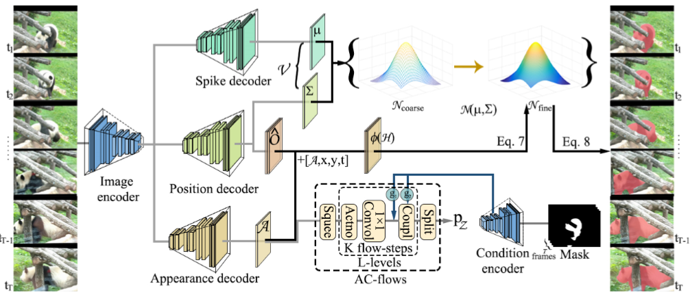

# ACMMM21-VIShv
Source codes of ACMMM21 paper: Learning Hierarchical Embeddings for Video Instance Segmentation[https://dl.acm.org/doi/10.1145/3474085.3475342]. 
In this paper, we propose a normalizing flow based generative method for video instance segmentation.
#



### Citation
If you find the code and dataset useful in your research, please consider citing:
```
@inproceedings{qin2021mm, 
  author = {Qin, Zheyun and Lu, Xiankai and Nie, Xiushan and Zhen, Xiantong and Yin, Yinlong},
  title = {Learning Hierarchical Embeddings for Video Instance Segmentation},
  booktitle = {ACM Multimedia},
  year = {2021}
}
```
